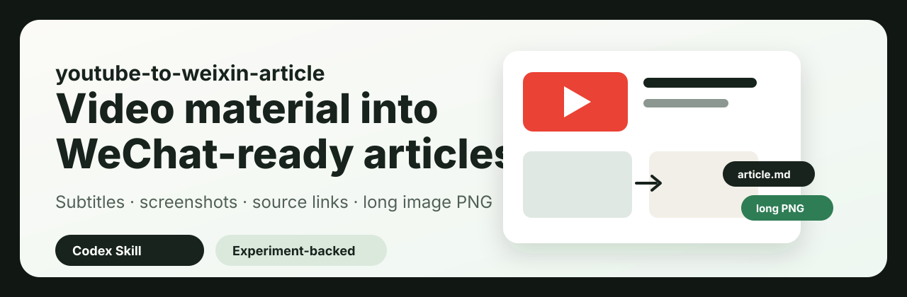

<p align="center">
  
</p>

# youtube-to-weixin-article

`youtube-to-weixin-article` 是一个把访谈内容转成深度长文和公众号长图的 Agent Skill。它面向内容团队，把 YouTube 视频、播客访谈、线上分享、字幕、截图、原始文章和视频链接整理成中文公众号深度长文，并输出可检查的公众号竖向长图。

项目的核心交付只有一个：根据用户提供的资料，生成可用于公众号编辑流程的文章与长图。实验、评分和整改流程作为项目文档保留，用来说明这个 Skill 如何通过晚点原文、晚点原文长图、同源视频资料、独立生成结果和独立评分逐步沉淀；这些流程不封装成普通用户调用时的额外功能。

项目包装参考了 [oil-skill-creator](https://github.com/oil-oil/oil-skill-creator) 的 Skill 创建、评审与发布思路，并参考 [beautify-github-readme](https://github.com/oil-oil/beautify-github-readme) 的 README 呈现方式，让首页优先讲清项目价值、证据链、使用路径和边界。

## 你会得到什么

| 交付物 | 说明 |
| --- | --- |
| 公众号深度长文 | 从字幕、视频资料和原始文章对照中重组出中文标题、金句、导入、小节、截图位置和结尾。 |
| 公众号长图 | 生成 1200px 宽、单栏、字号稳定、不出框、可预览的竖向 PNG。 |
| 截图判断 | 识别哪些视频帧适合证明观点、解释界面、增强现场感，避免装饰性配图。 |
| 来源控制 | 页尾显示公开来源链接，不暴露本地视频名、字幕名、截图名或本地路径。 |

## 项目分层

| 层级 | 是否给用户调用 | 说明 |
| --- | --- | --- |
| 训练和学习部分 | 否 | 晚点原文、原文长图、同源视频和字幕用于建立对照关系，相关方法记录在实验文档、评分文档和规则库中。 |
| 学习后的成果 | 是 | 用户安装 `youtube-to-weixin-article/` 后，只使用已经沉淀好的经验生成公众号深度长文和长图。 |

## 核心能力

### 视频资料的深度文章化

Skill 会从标题、简介、字幕、章节、视频截图和补充资料中提炼主线，按中文公众号深度长文的阅读习惯重组内容。输出重点放在观点判断、案例、数字、方法和读者启发，并压缩弱信息密度的逐段复述。

### 晚点原内容的学习来源

实验样本来自 `N:\C\提纲图文版\outputs\weixin_new2\videos`。每个样本文件夹里的 `article.md` 和 `原文长图.png` 是晚点原内容，分别作为文字结构和长图呈现的对照基准。项目通过对比晚点原文、晚点原文长图、同源视频链接、字幕和截图，总结标题命名、段落节奏、截图位置、来源展示和长图排版规则。

### 可发布长图的视觉交付

当输入中存在截图或视频源时，长图会嵌入可用视频截图，并在导出后检查文字出框、图片缺失、字号过小、图文重叠和来源展示问题。长图目标是进入公众号编辑前的可检查成品。

## 晚点对照样本

第二批学习样本位于本地目录 `N:\C\提纲图文版\outputs\weixin_new2\videos`，每个文件夹中的 `article.md` 和 `原文长图.png` 均按晚点原内容处理，用于建立文字稿和长图的对照关系。公开仓库只记录样本标题和方法，不上传晚点原文全文、原图或视频素材。

| 样本 | 对照内容 |
| --- | --- |
| `01_把AI变成工作系统的6个步骤丨Silicon Valley Girl` | 晚点原文、原文长图、同源视频与字幕 |
| `02_YC前负责人：如何找到 to C 的创业点子丨Dalton + Michael` | 晚点原文、原文长图、同源视频与字幕 |
| `03_Crazy Egg创始人：最佳营销渠道都是秘密丨Delphi` | 晚点原文、原文长图、同源视频与字幕 |
| `04_月入2.2万美元，不早起、不卷自律：他是怎么工作的？丨Starter Story` | 晚点原文、原文长图、同源视频与字幕 |
| `05_JJellyfish 联合创始人：如何一步步拿下10万美元以上的企业级交易丨Le` | 晚点原文、原文长图、同源视频与字幕 |

## 使用方式

安装 Skill：

```bash
npx skills add https://github.com/GhostWHO2012/podcast-article-full-flow --skill youtube-to-weixin-article
```

安装后可以这样调用：

```text
使用 youtube-to-weixin-article。
请只读取我指定的视频资料文件夹，生成公众号深度长文、截图建议和公众号竖向长图。
要求事实只来自我提供的材料；有截图或视频源时长图必须包含视频截图；页尾给公开来源链接，不要显示本地文件名。
```

## 推荐输入目录

```text
video-case/
  youtube链接.txt
  video.bilingual.srt
  video.srt
  video.zh.srt
  video.mp4
  images/
    01.png
    02.png
  article.md
  原文长图.png
  raw.html
```

最少需要提供字幕、转写文本或视频内容说明。若要生成可检查的公众号长图，建议同时提供截图目录，或者提供视频文件让智能体从视频中抽帧。

## 仓库结构

```text
.
├─ README.md
├─ PROJECT.md
├─ EXPERIMENT.md
├─ EVALUATION.md
├─ SKILL_REVIEW.md
├─ references/
│  ├─ README.md
│  ├─ weixin-article-rules.md
│  └─ project-packaging-standard.md
├─ evals/
│  ├─ README.md
│  └─ 2026-09-07-long-image-independent-review.md
├─ assets/
│  └─ readme/
│     └─ hero.svg
└─ youtube-to-weixin-article/
   ├─ SKILL.md
   ├─ agents/
   │  └─ openai.yaml
   └─ scripts/
      └─ render_weixin_long_image.py
```

## 证据链

| 文件 | 作用 |
| --- | --- |
| [`PROJECT.md`](PROJECT.md) | 项目定位、目标用户、能力边界和使用方式。 |
| [`EXPERIMENT.md`](EXPERIMENT.md) | 实验设计、晚点原文长图对照、样本材料、主要发现和迭代记录。 |
| [`EVALUATION.md`](EVALUATION.md) | 独立评分流程、评分标准和汇总规则。 |
| [`SKILL_REVIEW.md`](SKILL_REVIEW.md) | 技能评审、问题定位、整改状态和发布检查。 |
| [`references/weixin-article-rules.md`](references/weixin-article-rules.md) | 从样本中沉淀出的标题、结构、截图、长图和来源规则。 |
| [`references/wandian-learning-sources.md`](references/wandian-learning-sources.md) | 晚点学习样本来源说明和对照关系。 |
| [`evals/2026-09-07-long-image-independent-review.md`](evals/2026-09-07-long-image-independent-review.md) | 独立窗口长图重评记录。 |
| [`youtube-to-weixin-article/SKILL.md`](youtube-to-weixin-article/SKILL.md) | 真正可安装、可复用的 Skill 指令。 |

## 实验流程

```text
晚点原文长图（实验组）
        ↓
提取目标风格：标题、结构、截图、排版、来源
        ↓
同源视频 + 字幕 + 截图资料
        ↓
独立对话框使用 Skill 生成长图（测试组）
        ↓
独立评分窗口盲评
        ↓
汇总反馈，用户确认后写回 Skill
```

后续维护本项目时，先在当前对话中列出对需求的理解和可能存在的问题，用户确认后再修改文件、校验并上传。

## 已沉淀规则

| 模块 | 规则 |
| --- | --- |
| 标题 | 不直译 YouTube 标题，而是围绕人物身份、数字、反差、读者问题和频道来源重新命名。 |
| 结构 | 把字幕重组为六到八个主题小节和中文判断句。 |
| 篇幅 | 常规成稿控制在约 4000 到 5500 中文字，即使字幕很长也要强压缩。 |
| 截图 | 优先选择数据、演示、工作流、生活/工作现场、动作手势帧，再考虑普通人物访谈帧。 |
| 长图 | 默认 1200px 宽，单栏排版，中文字号可读，渲染后必须人工检查。 |
| 来源 | 展示公开来源链接，不在正文或长图页尾显示本地路径、视频文件名、字幕文件名或截图文件名。 |

## 当前边界

- 面向用户的 Skill 功能只包含公众号深度长文和长图生成。
- 实验、评分和整改流程保存在仓库文档中，用来说明方法和质量控制，不作为普通用户调用功能。
- 不承诺自动找到所有 YouTube 原视频；如果材料中没有公开链接，需要用户提供或允许检索。
- 不把评分窗口的单次审美偏好直接写入 Skill。
- 不上传晚点原文长图、字幕、视频文件或本地受限素材到仓库。
- 不把“静态校验通过”表述为“效果已经被完全证明”。

## 当前状态

最近一次 Skill 静态校验：通过。

本仓库现在包含三类资产：可安装 Skill、可复查实验文档、可持续迭代的评分与整改记录。
