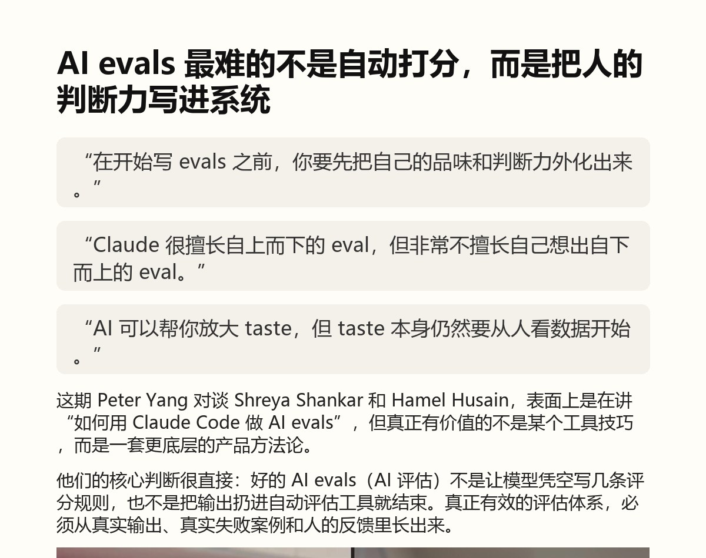
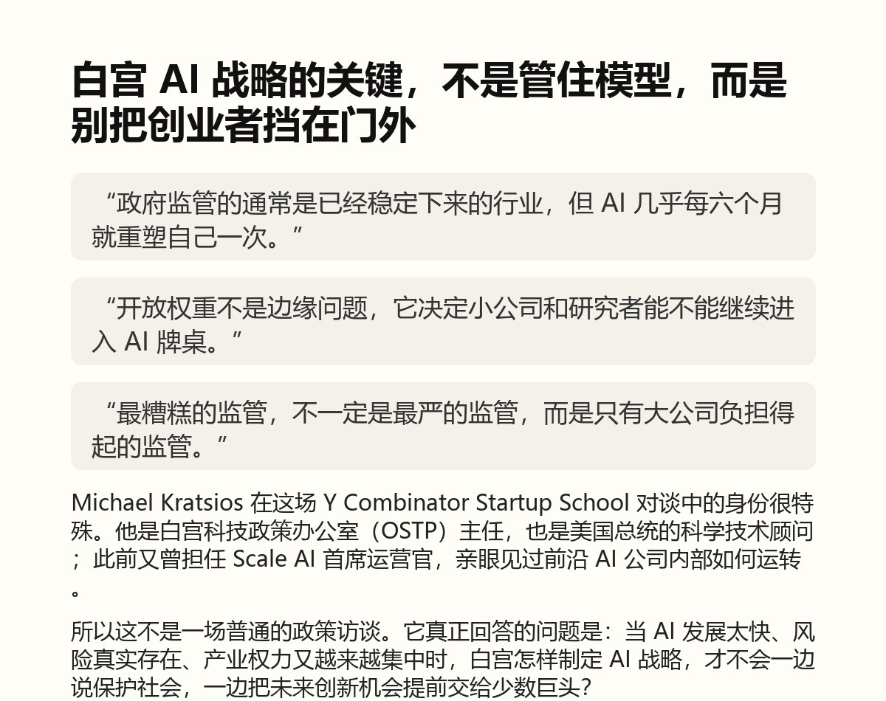

# 原文测试长图结果

本页记录使用 `youtube-to-weixin-article` 生成的测试组长图结果，用于复查每次用原文/同源资料测试后的实际效果。

这些结果属于实验与评估资料，不是用户版 Skill 的功能入口，也不改变用户安装后的使用方式。用户版 Skill 仍只提供“根据用户资料生成公众号深度长文和长图”的能力。

## 记录范围

本批记录来自“内容生成测试版”5 个独立测试样本。每个样本保留：

- `article.md`：测试组生成的文章稿；
- `article.long.png`：测试组生成的完整公众号长图；
- `preview.jpg`：长图顶部预览，用于在 GitHub 页面快速查看效果。

原始视频、字幕、原公众号全文和未授权素材不放入本页。

## 独立评分

对应独立评分记录：[2026-09-07 长图独立重评](../2026-09-07-long-image-independent-review.md)

| 排名 | 测试结果 | 分数 | 完整长图 | 文章稿 |
| --- | --- | ---: | --- | --- |
| 1 | AI Evals 与 Claude Code | 91 | [article.long.png](02-ai-evals-claude-code/article.long.png) | [article.md](02-ai-evals-claude-code/article.md) |
| 2 | Dianne Penn 谈 Vertical AI | 87 | [article.long.png](05-dianne-penn-vertical-ai/article.long.png) | [article.md](05-dianne-penn-vertical-ai/article.md) |
| 3 | ChatGPT Work / GPT-5.6 新手向 | 84 | [article.long.png](04-chatgpt-work-gpt56-beginner/article.long.png) | [article.md](04-chatgpt-work-gpt56-beginner/article.md) |
| 4 | Andrew Ambrosino 谈 Codex 与 ChatGPT | 82 | [article.long.png](03-andrew-ambrosino-codex-chatgpt/article.long.png) | [article.md](03-andrew-ambrosino-codex-chatgpt/article.md) |
| 5 | Michael Kratsios 白宫 AI 策略 | 79 | [article.long.png](01-michael-kratsios-white-house-ai/article.long.png) | [article.md](01-michael-kratsios-white-house-ai/article.md) |

## 效果预览

<table>
  <tr>
    <td width="33%" valign="top" align="center">
      <strong>AI Evals 与 Claude Code</strong><br><br>
      <a href="02-ai-evals-claude-code/article.long.png">
        
      </a><br>
      <sub>独立评分：91</sub>
    </td>
    <td width="33%" valign="top" align="center">
      <strong>Dianne Penn 谈 Vertical AI</strong><br><br>
      <a href="05-dianne-penn-vertical-ai/article.long.png">
        
      </a><br>
      <sub>独立评分：87</sub>
    </td>
    <td width="33%" valign="top" align="center">
      <strong>ChatGPT Work / GPT-5.6 新手向</strong><br><br>
      <a href="04-chatgpt-work-gpt56-beginner/article.long.png">
        
      </a><br>
      <sub>独立评分：84</sub>
    </td>
  </tr>
  <tr>
    <td width="33%" valign="top" align="center">
      <strong>Andrew Ambrosino 谈 Codex 与 ChatGPT</strong><br><br>
      <a href="03-andrew-ambrosino-codex-chatgpt/article.long.png">
        
      </a><br>
      <sub>独立评分：82</sub>
    </td>
    <td width="33%" valign="top" align="center">
      <strong>Michael Kratsios 白宫 AI 策略</strong><br><br>
      <a href="01-michael-kratsios-white-house-ai/article.long.png">
        
      </a><br>
      <sub>独立评分：79</sub>
    </td>
    <td width="33%" valign="top" align="center">
      <strong>后续测试</strong><br><br>
      每次使用原文或同源资料进行独立测试后，按同样结构新增 case，并在本页追加评分与预览入口。
    </td>
  </tr>
</table>

## 后续记录规则

每次新增原文测试结果时，放入一个新的子目录，并至少包含：

```text
evals/long-image-test-results/<case-slug>/
  article.md
  article.long.png
  preview.jpg
```

同时更新本页的评分表和预览区。如果该次测试产生了独立评分记录，也在 `evals/` 下新增评分文档并从本页链接过去。
