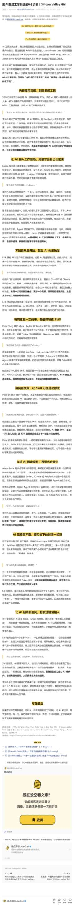
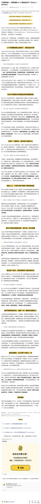
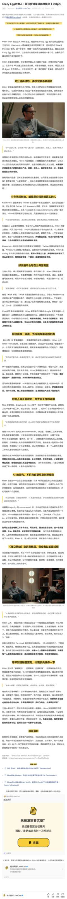

# 晚点原长图对照页

本页用于单独承载晚点原长图对照入口，避免在 README 首页直接铺开长图。下方显示小尺寸缩略图，点击缩略图可打开原版长图。

<table>
  <tr>
    <td width="33%" valign="top" align="center">
      <strong>01 把 AI 变成工作系统的 6 个步骤</strong>  
       
      点击缩略图查看原版
    </td>
    <td width="33%" valign="top" align="center">
      <strong>02 YC 前负责人：如何找到 to C 的创业点子</strong>  
       
      点击缩略图查看原版
    </td>
    <td width="33%" valign="top" align="center">
      <strong>03 Crazy Egg 创始人：最佳营销渠道都是秘密</strong>  
       
      点击缩略图查看原版
    </td>
  </tr>
</table>
